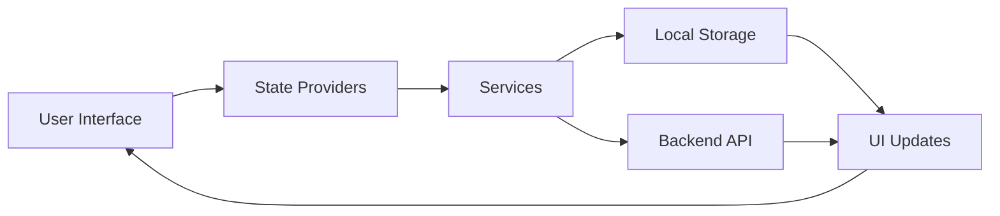
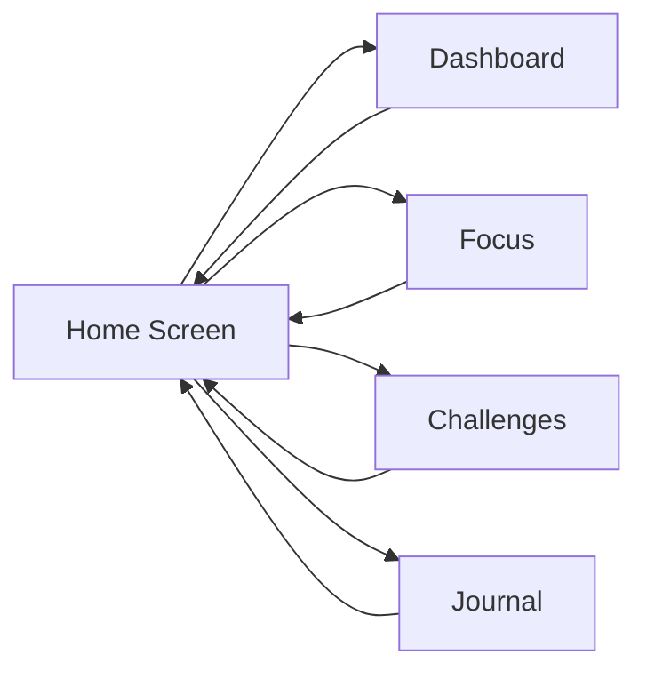
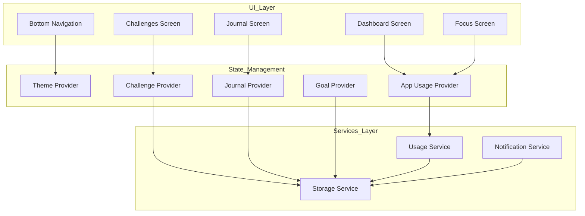
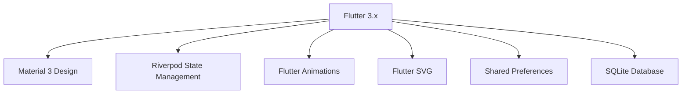

# Unplug App - Architecture Diagram

## Overview
This document provides a visual representation of the Unplug app architecture using Mermaid diagrams.

## High-Level Architecture

```mermaid
graph TD
    A[Unplug App] --> B[Main Application]
    A --> C[Configuration]
    A --> D[Data Models]
    A --> E[State Management]
    A --> F[Screens]
    A --> G[UI Components]
    A --> H[Services]
    A --> I[Utilities]
    A --> J[Navigation]

    C --> C1[Theme Management]
    C --> C2[Constants]

    D --> D1[AppUsage]
    D --> D2[Challenge]
    D --> D3[JournalEntry]
    D --> D4[Goal]
    D --> D5[FocusSession]
    D --> D6[User]

    E --> E1[Riverpod Providers]

    F --> F1[Dashboard]
    F --> F2[Focus]
    F --> F3[Challenges]
    F --> F4[Journal]
    F --> F5[Home]

    G --> G1[Common Widgets]
    G --> G2[Shared Components]

    H --> H1[Usage Tracking]
    H --> H2[Notifications]
    H --> H3[Storage]

    I --> I1[Date Utilities]
    I --> I2[Validation]
    I --> I3[Logging]
```

## Folder Structure Diagram

```mermaid
graph TD
    lib[lib/] --> main[main.dart]
    lib --> app[app.dart]
    lib --> config[config/]
    lib --> models[models/]
    lib --> providers[providers/]
    lib --> screens[screens/]
    lib --> widgets[widgets/]
    lib --> services[services/]
    lib --> utils[utils/]
    lib --> routes[routes/]

    config --> theme[theme/]
    config --> constants[constants/]

    theme --> app_theme[app_theme.dart]
    theme --> theme_notifier[theme_notifier.dart]

    constants --> app_colors[app_colors.dart]
    constants --> app_strings[app_strings.dart]
    constants --> app_dimensions[app_dimensions.dart]

    models --> app_usage[app_usage.dart]
    models --> challenge[challenge.dart]
    models --> journal_entry[journal_entry.dart]
    models --> goal[goal.dart]
    models --> focus_session[focus_session.dart]
    models --> user[user.dart]

    providers --> theme_provider[theme_provider.dart]
    providers --> app_usage_provider[app_usage_provider.dart]
    providers --> challenge_provider[challenge_provider.dart]
    providers --> journal_provider[journal_provider.dart]
    providers --> goal_provider[goal_provider.dart]

    screens --> dashboard[dashboard/]
    screens --> focus[focus/]
    screens --> challenges[challenges/]
    screens --> journal[journal/]
    screens --> home[home/]

    dashboard --> dashboard_screen[dashboard_screen.dart]
    dashboard --> dashboard_widgets[widgets/]

    focus --> focus_screen[focus_screen.dart]
    focus --> focus_widgets[widgets/]

    challenges --> challenges_screen[challenges_screen.dart]
    challenges --> challenges_widgets[widgets/]

    journal --> journal_screen[journal_screen.dart]
    journal --> journal_widgets[widgets/]

    home --> home_screen[home_screen.dart]

    widgets --> common[common/]
    widgets --> shared[shared/]

    common --> app_bar[app_bar.dart]
    common --> bottom_nav[bottom_nav.dart]
    common --> loading_indicator[loading_indicator.dart]

    shared --> animated_progress[animated_progress_bar.dart]
    shared --> themed_button[themed_button.dart]
    shared --> responsive_container[responsive_container.dart]

    services --> usage_service[usage_service.dart]
    services --> notification_service[notification_service.dart]
    services --> storage_service[storage_service.dart]

    utils --> date_utils[date_utils.dart]
    utils --> validation_utils[validation_utils.dart]
    utils --> logger[logger.dart]

    routes --> app_routes[app_routes.dart]
```

## Data Flow Diagram

## Navigation Flow

## Component Interaction

## Technology Stack

This architecture provides a scalable, maintainable structure for the Unplug application that supports all the required features while maintaining clean separation of concerns.